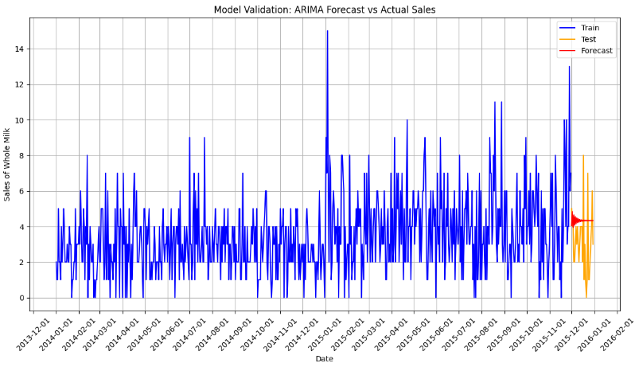
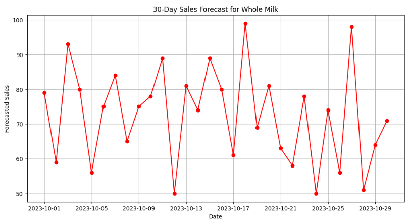

<link rel="stylesheet" href="styles.css" type="text/css">
<link rel="stylesheet" href="site_libs/academicons-1.9.1/css/academicons.min.css"/>

   

## **Groceries Market Basket Analysis**

   

### 1. Figure

[Fig. Prediction Using ARIMA]

 

  

### 2. Goal
The project involves analyzing the Kaggle Groceries dataset to study sales forcasting. Aiming to use and understand time-series analysis to forecast the sales of the most frequently purchased items. This helps in inventory management and promotional planning.

 

### 3. Methodology & Summary

  + Time-Series Analysis with ARIMA: The cornerstone of our analysis is the application of the AutoRegressive Integrated Moving Average (ARIMA) model for time-series forecasting. By selecting the ARIMA model, we aimed to capture various temporal structures in the sales data, such as seasonality and trends, thereby enhancing the accuracy of our sales forecasts.
  
  + Day-of-Week Trends: We enriched our dataset with a 'Day_of_week' variable to unveil unique shopping behaviors associated with specific weekdays. The insights derived from this enabled us to identify the most and least popular days for shopping, serving as a basis for targeted promotional activities.
  
  + Inventory Management: Leveraging the ARIMA-based time-series forecasts, we achieved a more nuanced understanding of inventory requirements. This precise forecasting method allows for optimized inventory levels, reducing both holding and shortage costs.

  + Sales Forecasting: The culmination of our project was the development of a robust sales forecasting model based on the ARIMA algorithm. This model not only predicts future sales but also provides confidence intervals, offering a comprehensive tool for inventory management and promotional planning.
 

### 4. Code

Please click [HERE](https://nbviewer.org/github/keuntaepark/Market-Basket-Analysis-using-groceries-dataset/blob/main/Market_Basket_Analysis.ipynb) for the analysis report and code.

 

