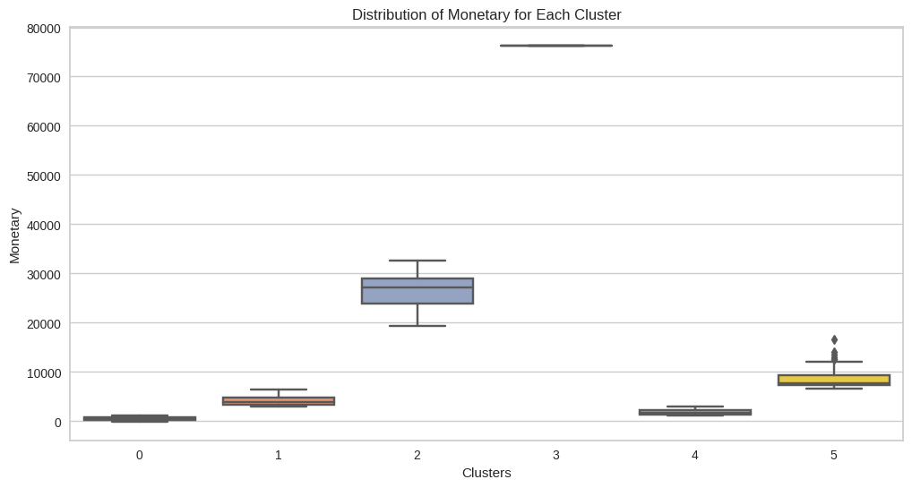
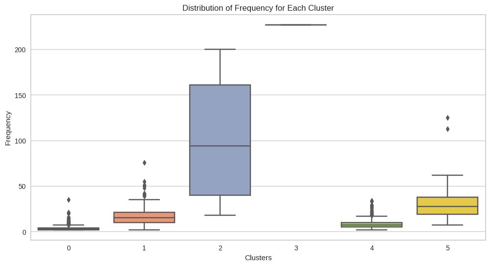
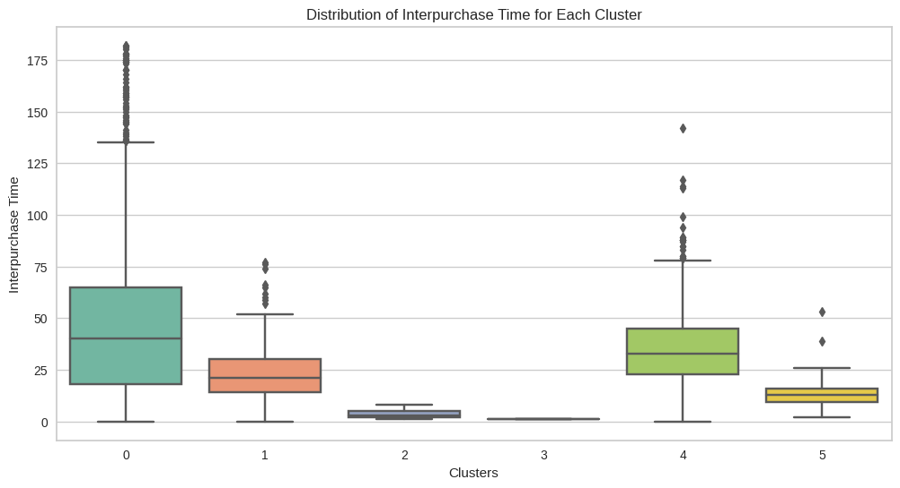

<link rel="stylesheet" href="styles.css" type="text/css">
<link rel="stylesheet" href="site_libs/academicons-1.9.1/css/academicons.min.css"/>

   

## **Groceries Market Basket Analysis**

   

### 1. Figure

[Fig. Segmentation by K-Means Clustering]

 

  

### 2. Goal
To gain a comprehensive understanding of customer behavior, preferences, and purchasing patterns, segmentation is employed utilizing multiple variables, including the newly introduced variable, Inter-purchase Time.

 

### 3. Methodology & Summary

  + RFM: Serving as the foundational framework for customer segmentation, the RFM model categorizes customers based on Recency, Frequency, Monetary value, and the newly introduced variable, Interpurchase Time. This amalgamation enables us to pinpoint distinct behavioral patterns with enhanced precision.
  
  + KMeans 6 segments: Utilizing the KMeans Algorithm, we segmented customers into six distinct groups based on the enriched RFM model. This thorough analysis helps us identify clusters of customers who exhibit similar characteristics, enabling us to develop highly targeted marketing strategies. Notably, Cluster 2 stands out in this analysis due to its high monetary and frequency metrics compared to other clusters, along with a low inter-purchase interval.
  
  + Silhouette: Following the segmentation, we conduct Silhouette analysis to gauge the quality of our clustering methodology. By shedding light on the separation between clusters, this analysis reinforces the robustness of our chosen approach.

 

### 4. Code

Please click [HERE](https://nbviewer.org/github/keuntaepark/Market-Basket-Analysis-using-groceries-dataset/blob/main/Market_Basket_Analysis.ipynb) for the analysis report and code.

 

