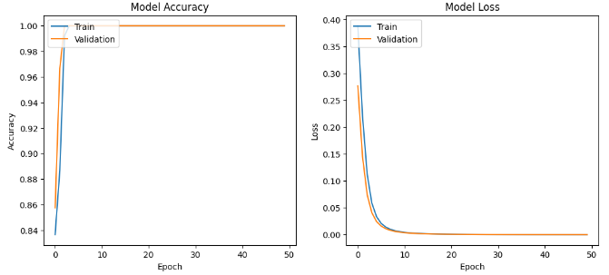
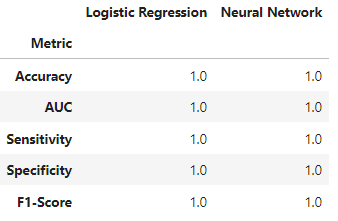

<link rel="stylesheet" href="styles.css" type="text/css">
<link rel="stylesheet" href="site_libs/academicons-1.9.1/css/academicons.min.css"/>

   

## **Customer Churn Prediction**

   

### 1. Figure

[Fig. Logistic Regression Model ROC Curve]

[Fig. Neural Network Model Accuracy & Loss]

[Fig. Modeling Evaluation]

 

  

### 2. Goal
The project's goal is to adeptly employ Logistic Regression and Neural Networks for precise prediction and in-depth analysis of customer churn in the credit card industry. This study not only aims at predicting churn but also seeks to uncover key factors driving it. The insights derived are intended to inform robust customer retention strategies and set the stage for future advancements in churn prediction and business analytics.

 

### 3. Methodology & Summary

  + Advanced Analytics in Customer Churn Prediction:

In this project, I demonstrate the application of advanced analytical techniques, Logistic Regression and Neural Networks, to predict customer churn in the credit card industry. This dataset is comprehensive, encompassing over 10,000 customers and 23 diverse features, providing a rich basis for analysis.
  
  + In-Depth Data Analysis and Rigorous Preprocessing:

A meticulous data exploration and preprocessing phase underscored the project. I employed standard scaling on the numerical variables, a crucial step that ensures a balanced input to the machine learning algorithms, enhancing model accuracy and reliability.

  
  + Innovative Model Training and Performance Evaluation:

The training phase involved splitting the data into distinct training and testing sets, ensuring a robust evaluation of the models. I leveraged a Logistic Regression model and a custom-designed Neural Network, assessing their performance based on accuracy in predicting churn. This rigorous evaluation illustrates my commitment to delivering precise and actionable insights.
 

### 4. Code

Please click [HERE](https://nbviewer.org/github/keuntaepark/Customer_Churn_Prediction/blob/main/Customer_Churn_Prediction.ipynb) for the analysis report and code.

 

